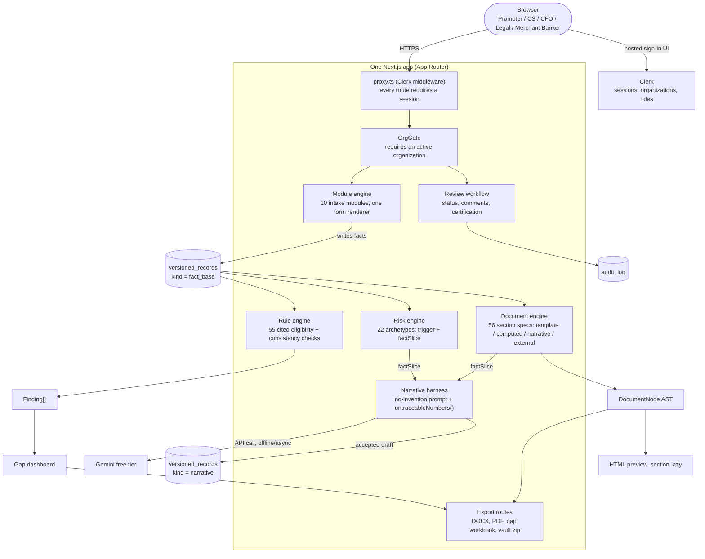
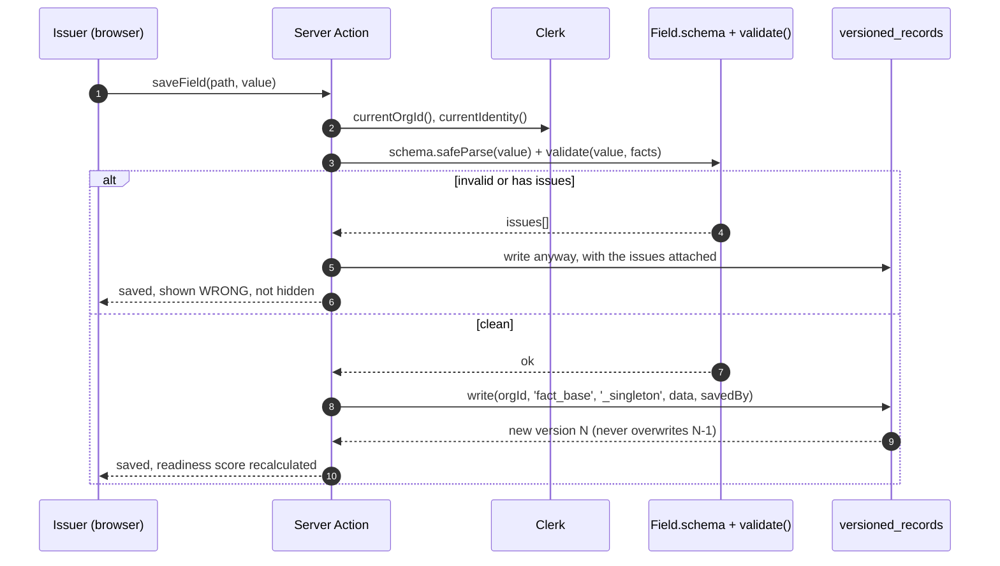
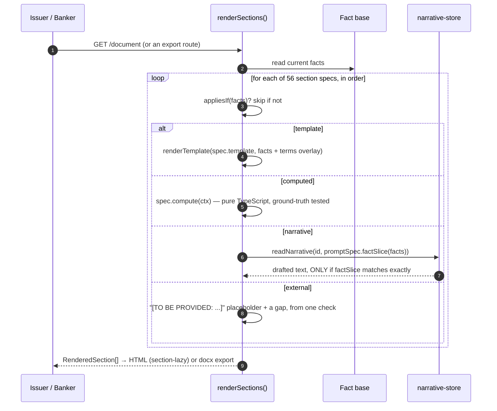
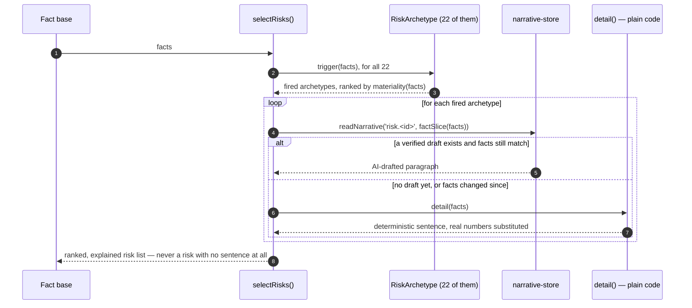
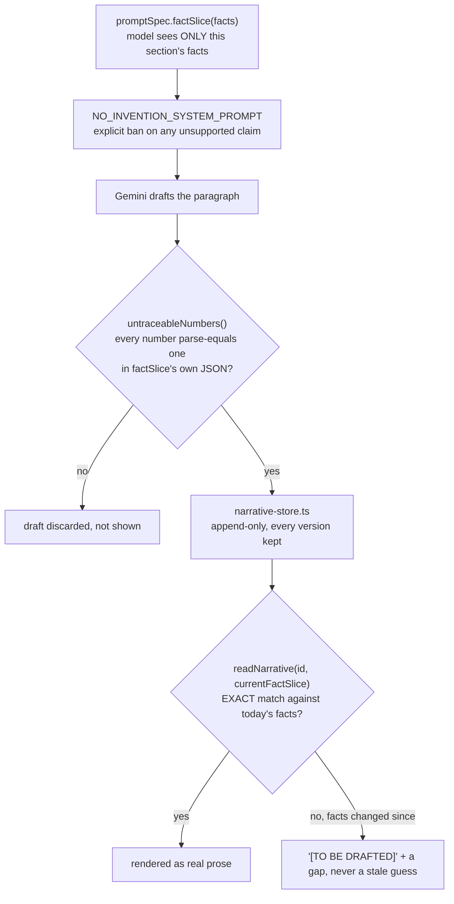
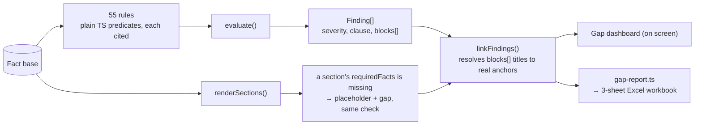
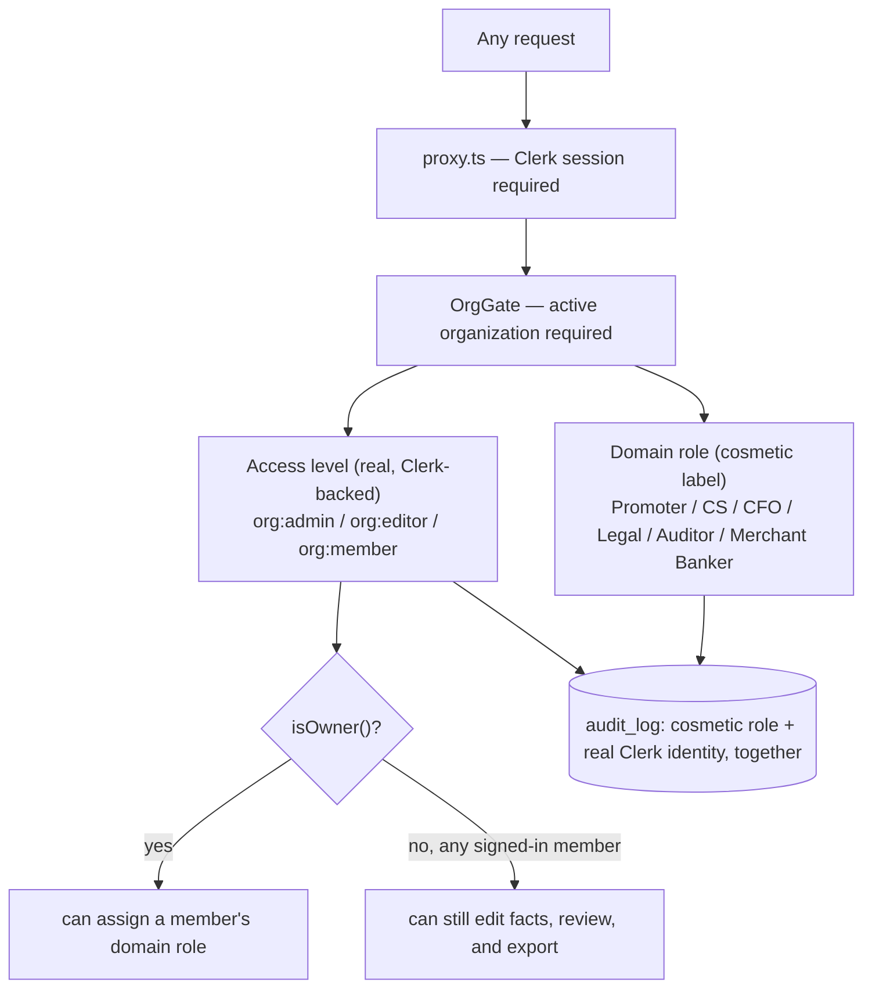
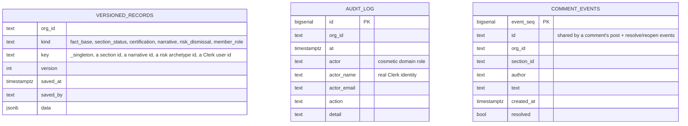
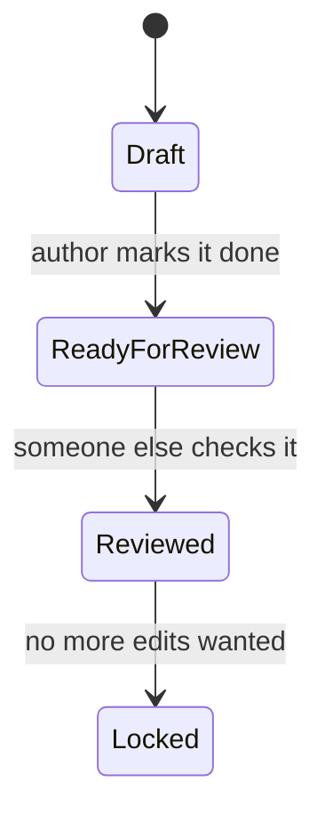
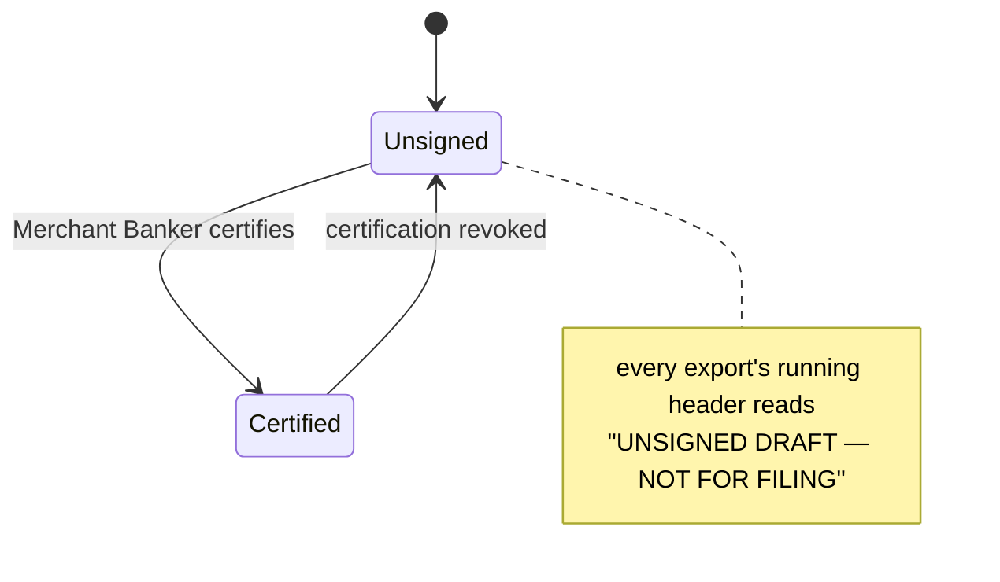

# Setu

**SME IPO Draft Prospectus Builder.** Takes an SME issuer from a blank intake form to a structurally complete, citation-backed **draft SEBI
prospectus**, flags every gap and inconsistency with the exact regulatory clause it violates, and hands the
result to a merchant banker to review and certify.

It does not replace the merchant banker, the auditor or
legal counsel — it replaces the months of due-diligence-questionnaire-by-email that happen before any of them
start certifying anything.

Live demo: https://setu-mu-three.vercel.app/

## Tech stack

| Concern                    | Tool                                                                                                         |
| -------------------------- | ------------------------------------------------------------------------------------------------------------ |
| Framework                  | Next.js 16.3.4 (App Router), React 19.2.8, TypeScript                                                        |
| Validation / domain schema | Zod 4.5.4 — one schema drives form validation, the LLM's structured-output schema, and every TypeScript type |
| Auth                       | Clerk (`@clerk/nextjs`) — sessions, organizations, two built-in org roles                                    |
| Database                   | Supabase Postgres (`@supabase/supabase-js`), service-role key, server-only                                   |
| LLM                        | Gemini free tier (`@google/genai`) — narrative drafting only, never fact storage                             |
| Money                      | decimal.js — every rupee and percentage; never a native float                                                |
| Document export            | `docx` (Word), `exceljs` (gap workbook), `jszip` (document vault), `unpdf` (PDF text layer, dormant feature) |
| Forms                      | React Hook Form + `@hookform/resolvers`                                                                      |
| UI                         | Tailwind 4, shadcn/ui, lucide-react                                                                          |
| Tests                      | Vitest 5                                                                                                     |

## Which store holds what

| Store                                             | Holds                                                                       | Why                                                                                                                                                                                                                                |
| ------------------------------------------------- | --------------------------------------------------------------------------- | ---------------------------------------------------------------------------------------------------------------------------------------------------------------------------------------------------------------------------------- |
| `versioned_records` (Postgres, one generic table) | fact base, section status, certification, narrative drafts, risk dismissals | All five were independently "an append-only version history keyed by an id, read-latest-wins." One table with a `(org_id, kind, key, version)` primary key instead of five near-identical ones — `kind` keeps them from colliding. |
| `audit_log` (Postgres, its own table)             | every review/workflow action                                                | A flat, ever-growing log with no "current" state — nothing to version.                                                                                                                                                             |
| `comment_events` (Postgres, its own table)        | section comment threads                                                     | Append-only too, but many events belong to one _section_, not one linear history per id.                                                                                                                                           |
| Clerk (external, not queried directly)            | users, organizations, sessions, org roles                                   | Auth is a bought problem, not a built one.                                                                                                                                                                                         |
| Gemini (external, stateless)                      | nothing persisted here                                                      | Drafts text on request; every accepted draft is immediately written back into `versioned_records` — the model itself holds no state between calls.                                                                                 |

## Architecture

### The idea in one picture



### What happens when an issuer saves one answer



A value is always stored, even when it fails validation — refusing to save a half-typed date would silently
lose the issuer's work, and "wrong" has to be a visible, different state from "never answered."

### What happens when the document is rendered



Narrative drafts are never generated inline at render time — `renderSection()` is synchronous. A script calls
the drafting harness offline, ahead of time; rendering only ever reads whatever the store already has.

### How a risk factor gets its paragraph



Every fired risk always has a guaranteed, plain-code sentence as a floor. A nicer AI-drafted version only
replaces it when one has been generated and the underlying facts haven't moved since.

### The never-invent pipeline (narrative and risk drafting)



### Rules and gaps becoming one dashboard (and one Excel file)



### Auth and access control



Two genuinely separate systems, on purpose. **Access level** answers "what is this person technically allowed
to do" — and today it gates exactly one action (assigning someone's domain role); an earlier version also
gated editing and exporting, and that was deliberately reversed. **Domain role** answers "who is this person
acting as in the document" and has no bearing on access at all. `Owner` in the domain-role list is special: it
is never picked, it's derived live from holding real Clerk admin access, so it can never go stale.

### Postgres schema



`kind`/`key` are logical discriminators inside one table, not foreign keys — there's deliberately no
cross-table relational structure here. Primary key on `versioned_records` is
`(org_id, kind, key, version)`, which already sorts "give me every version of this, newest first" for free —
no secondary index needed for the only query shape this table serves.

### Section status lifecycle



### Export watermark / certification



There's deliberately no page watermark — an early build used one and it painted over body text, making a
table unreadable in the rendered page. The draft-state warning lives in the page header instead, and
disappears from every export the moment certification happens.

## Getting started

### Prerequisites

- Node.js (observed working on v22; no `engines` field is pinned in `package.json`)
- A Clerk application with **Organizations** enabled
- A Supabase project (Postgres)
- Optionally, a Gemini API key — the app degrades gracefully without one; narrative drafting just has nothing
  to read

### Install and configure

```bash
npm install
```

Create `.env.local` (copy `.env.local.example`):

```env
GEMINI_API_KEY=

NEXT_PUBLIC_CLERK_PUBLISHABLE_KEY=
CLERK_SECRET_KEY=

NEXT_PUBLIC_SUPABASE_URL=
SUPABASE_SERVICE_ROLE_KEY=
NEXT_PUBLIC_SUPABASE_PUBLISHABLE_KEY=

SUPABASE_URL=
SUPABASE_PUBLISHABLE_KEY=
SUPABASE_SECRET_KEY=
SUPABASE_JWKS_URL=
```

**The two `CLERK_*` keys are load-bearing** — the app won't boot without them. Get them from
[clerk.com](https://clerk.com): create an application, enable **Organizations** (Configure → Organizations),
and copy the two keys from **API keys**. Optionally create one custom organization role with slug `editor`
(Configure → Roles) for a three-tier access model instead of two — see `lib/auth/require-role.ts`.

**The `SUPABASE_*` keys are also load-bearing** for anything that writes a fact — every store reads through
`lib/store/supabase-client.ts`'s service-role client. Create the schema once, by hand, via the Supabase SQL
Editor or `supabase db push`:

```bash
# paste supabase/migrations/0001_org_scoped_stores.sql into
# Supabase → SQL Editor → New query → Run
```

There is no migration runner wired into `npm install` or app startup — this is a one-time, manual step.

### Run

```bash
npm run dev     # next dev
npm run build   # next build
npm run start   # next start
npm run lint    # eslint
```

There is no `npm test` script — run the suite directly:

```bash
npx vitest run
npx tsc --noEmit
```

## Routes

| Route                                                          | What it is                                               | Access                                           |
| -------------------------------------------------------------- | -------------------------------------------------------- | ------------------------------------------------ |
| `/`                                                            | Home — readiness summary, links into the rest of the app | signed-in org member                             |
| `/sign-in`, `/sign-up`                                         | Clerk-hosted auth                                        | public                                           |
| `/eligibility`                                                 | 6-step SEBI/exchange pre-check                           | signed-in org member — see **Known limitations** |
| `/intake`, `/intake/[moduleId]`                                | The 10 fact-intake modules                               | signed-in org member                             |
| `/document`                                                    | Live HTML preview, section by section                    | signed-in org member                             |
| `/document/gaps`                                               | On-screen gap dashboard                                  | signed-in org member                             |
| `/review`                                                      | Section status + comments                                | signed-in org member                             |
| `/review/risks`                                                | Fired risk factors, dismiss-with-reason                  | signed-in org member                             |
| `/review/audit`                                                | The append-only audit log                                | signed-in org member                             |
| `/settings/members`                                            | Real org member list + domain-role assignment            | assignment itself is Owner-only                  |
| `/export`                                                      | Links to every export format                             | signed-in org member                             |
| `/export/docx`, `/export/pdf`, `/export/gaps`, `/export/vault` | Route Handlers streaming the actual files                | signed-in org member                             |
| `/extract`                                                     | Document-upload + AI-extraction UI                       | built, dormant — see **Known limitations**       |

## How the important parts work

**Never floats for money.** Every rupee and percentage is a `decimal.js` value or a decimal-shaped string
through the whole pipeline — share counts are safe as plain integers, prices and percentages are not.

**Never invent.** A missing fact renders as a highlighted `[TO BE PROVIDED: ...]` **and** raises a gap, from
the _same_ check (`requiredFacts` on a section spec) — there's no path where one happens without the other.
LLM drafting carries its own, separate version of the same discipline (see the never-invent diagram above).

**Provenance sits beside a fact, not wrapped around it.** The obvious design wraps every value in
`{ value, source, confidence, ... }`. That's wrong here specifically because the same Zod schema also drives
the LLM's structured-output schema — wrapping every field would ask the model to self-report its own
confidence and source. Facts stay plain; a parallel map (keyed by the same dotted path) carries provenance,
attached by the calling code, never by the model.

**One generic table instead of five.** Five independent local-JSON stores turned out to be the exact same
shape on disk — append-only, read-latest-wins — so the Postgres migration gave them one shared table
discriminated by `kind`, instead of five near-identical ones.

**`orgId` is always an explicit parameter, never read internally from a global.** A store function that
called Clerk's `auth()` itself would be untestable outside a live Clerk session, which Vitest has no way to
fake — so every store call takes `orgId` as a parameter, resolved once per request.

**RLS is on, with zero policies, on purpose.** The app only ever connects with the Postgres service-role key,
which bypasses RLS regardless of whether it's enabled — so turning it on doesn't change runtime behavior at
all. It's there purely so Supabase's own dashboard stops flagging these tables as exposed to the anon key,
which this app never uses for them. The real tenant-isolation boundary is: verified Clerk session → verified
active org → an explicit `org_id` filter on every single query, in application code.

**No RAG, no vector database, by design.** The regulatory knowledge here (citations, thresholds, template
text) is small, fixed, and correctness-critical — it was extracted once from real filed prospectuses,
corroborated across multiple documents, and hand-written as ordinary tested code with a citation. A live
semantic search over that knowledge would risk retrieving something _close but wrong_, which a legal document
can't absorb. Per-issuer facts aren't a search problem either — a normal row lookup by an exact key is simpler
and fully deterministic.

## Where the regulatory knowledge actually came from

1. **8 real, already-published SME IPO prospectuses** were collected (7 on disk) — actual BSE SME / NSE Emerge
   filings, not synthesized.
2. **7 were read closely.** Any rule, threshold or boilerplate clause had to be corroborated across at least
   two independent documents before being trusted — reading only one source produced wrong numbers more than
   once during research (even a public regulator board memo was wrong on 5 of 6 cited figures against what was
   actually notified).
3. **Once corroborated, it became ordinary, tested code with a citation** — never a document the app searches
   at runtime.
4. **The 8th document was never touched while anything was being built.** It exists purely as an independent
   check run afterward, and it caught real mistakes this way — including an individual-bid cap that two
   _building_ documents agreed on, which turned out to be wrong main-board boilerplate already shipped into a
   live rejection rule.

The 22 risk archetypes went through the same process, applied to the "Risk Factors" chapters specifically: a
theme only became an archetype if it appeared as its own numbered risk in more than one document **and** had
a real, checkable fact already in the intake schema to trigger it. Generic hedging every document repeats
("our industry is competitive") was deliberately left out — there's no per-issuer fact behind it to check.

## Testing

```bash
npx vitest run      # 737 passed, 1 skipped, 45 files, last verified
npx tsc --noEmit     # clean
```

No separate test database and no live network calls in the suite: every store that touches Postgres has a
`createFake*`/`__set*ForTests` in-memory swap, and LLM calls go through a `createFakeClient()` instead of a
real Gemini call. Every rule, every risk archetype, and every document section has a fixture-backed test;
computed sections (capital tables, allotment history) are additionally checked against a real published
prospectus's own figures, row for row — "close" is treated as a failure. DOCX/PDF output is verified by
actually rendering it and reading the pages, not just asserting the XML looks right.

**Not covered:** no end-to-end suite, and the comment-store's `addComment`/`resolveComment` actions have no UI
calling them at all right now (a pre-existing gap from an earlier redesign, unrelated to any recent change).

## Project structure

```
app/
  (app)/                         everything that needs a signed-in org: /, /intake, /document,
                                  /review, /export, /eligibility, /extract, /settings/members
  sign-in/[[...sign-in]]         Clerk-hosted sign-in
  sign-up/[[...sign-up]]         Clerk-hosted sign-up
proxy.ts                         Next 16's renamed middleware.ts — Clerk session gate for every route
supabase/migrations/             one hand-applied SQL migration (versioned_records, audit_log, comment_events)
lib/
  facts/                         Zod schemas + the provenance map (FactPath, ProvenanceMap, isUsable())
  modules/                       Module/Field spec types + the 10 module specs (M1–M10)
  document/
    sections/                   the 56 section specs, one file (or a few) per subsection
    section.ts                   SectionSpec, renderSection(), renderSections(), gap collection
    docx.ts                      the Word renderer, same RenderedSection[] as the HTML view
  rules/                         Rule type, evaluate(), 55 eligibility/consistency predicates
  risk/                          RiskArchetype type, selectRisks(), the 22 archetypes
  llm/                           narrative.ts (the drafting harness), client.ts (Gemini + fake)
  store/                         versioned-table.ts (the generic Postgres store) + 7 thin wrappers
  auth/                          require-role.ts, org-context.ts — Clerk-backed access level + identity
  review/                        the cosmetic domain-role type and its reader
  export/                        gap-report.ts (Excel), bundle.ts (the vault zip), pdf.ts
  capital/, financials/, legal/  pure computation: build-up tables, ratios, materiality thresholds
  corpus/, seed/                 the reversed-corpus test fixtures and the synthetic demo issuer
  document-intake/                dormant — the paused S7 extraction pipeline
components/                      module-form.tsx (one renderer for all 10 modules), document-view.tsx,
                                  gap-dashboard.tsx, repeater.tsx, org-gate.tsx, member-role-row.tsx
.claude/context/                 domain research, the architecture spec, and an append-only decision log
```

## Known limitations

- **Vercel needs its own copy of every environment variable.** Pushing to git never pushes `.env.local` (it's
  gitignored by design) — the deployed build throws Clerk's `Missing publishableKey` error until every variable
  is added again under the Vercel project's Settings → Environment Variables, then redeployed.
- **No server-side permission enforcement beyond one action.** Any signed-in org member can edit the fact
  base, change review status, and download every export; only assigning someone's domain role is restricted
  to the Owner. This was a deliberate reversal of an earlier, stricter version — not an oversight — but it's
  worth stating plainly rather than implying a finer-grained permission model exists.
- **No Postgres RLS policies** — explained above, a documented trade-off, not an unnoticed gap.

- **The fixed-price SME branch was never built.** Branch points (`Section.appliesIf`) exist on the five
  sections that would differ from a book-built issue, but the reference corpus never grew past one fixed-price
  document, so there was never enough to extract a second template set from.
- **The risk-factor registry is closed at 22 archetypes, short of the original ~40 target, by user decision.**
  The engine and every supporting mechanism (dismissal, "why this fired") are complete; growing the registry
  further is no longer planned work.
- **No CI/CD, no Docker, no infrastructure-as-code.** Tests and type-checking are run by hand; the one SQL
  migration was applied by hand via the Supabase dashboard.
- **One organization = one issuer, with no cross-organization or portfolio view** — by design, not yet, since
  the app never had a multi-issuer concept to begin with.
